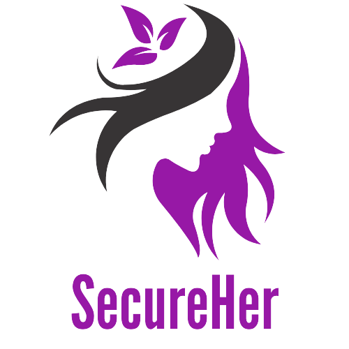

# SecureHer
This is full stack web application. The main idea of this application is provide ease of access to lodge a complaint in case of sexual harassment at workplace. Know the real time status of the complaint filed . Send "SOS e-mails" to added contacts with "LIVE LOCATION" of the user.

# Idea behind SecureHer

<ul> 
<li>Providing ease of access to lodge a complaint in case of sexual harassment at workplace.</li>

<li>Complaint should contain Date, Name of accused, Description and file attached as proof(if any).</li>

<li>Know the real time status of the complaint filed.</li>

<li>Send SOS e-mails to added contacts.</li>
</ul>

# SecureHer Details

<ul>
<li>The website asks the user to Sign In or Create an account.</li>

<li>User can then file a new complaint or check the status of already filed complaints.</li>

<li>Once a complaint is filed admin can login and get the list of active complaints, he can start the investigation and can keep on updating the current status of the complaint which user can see in real time.</li>

<li>The website asks the user to Add contacts to whom they would like to inform in need of help. There are features to Add, Delete and View Saved contacts.</li>

<li>The entered contacts and complaints along with User details are saved in MongoDB database.</li>

<li>On clicking the Emergency button an e-mail containing alert message with users live location is sent to provided users.</li>
</ul>
